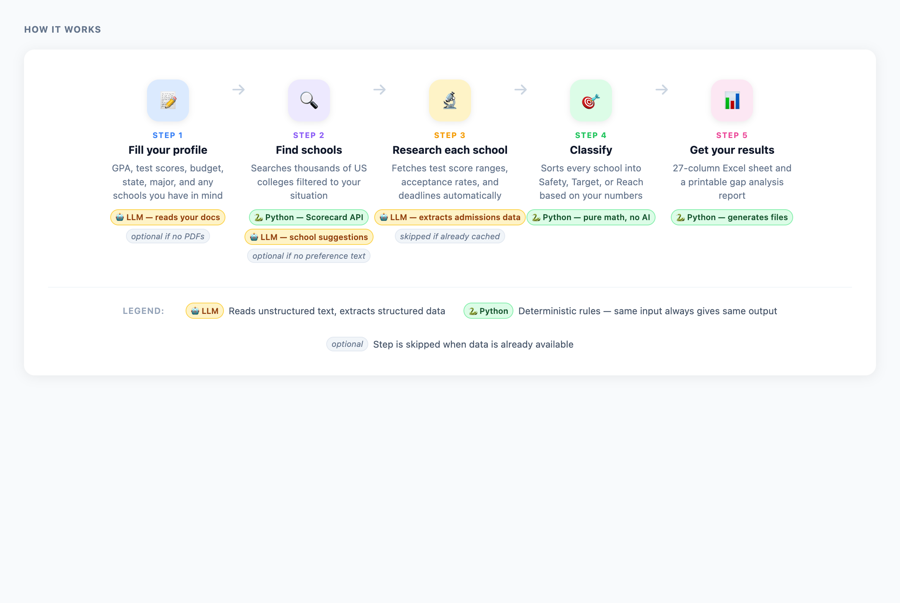
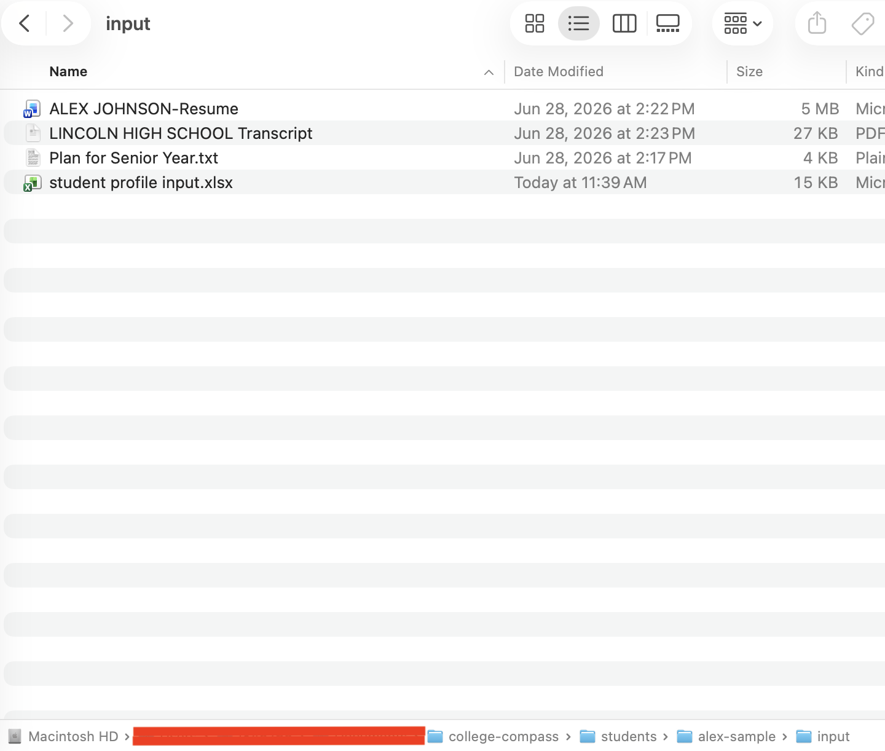
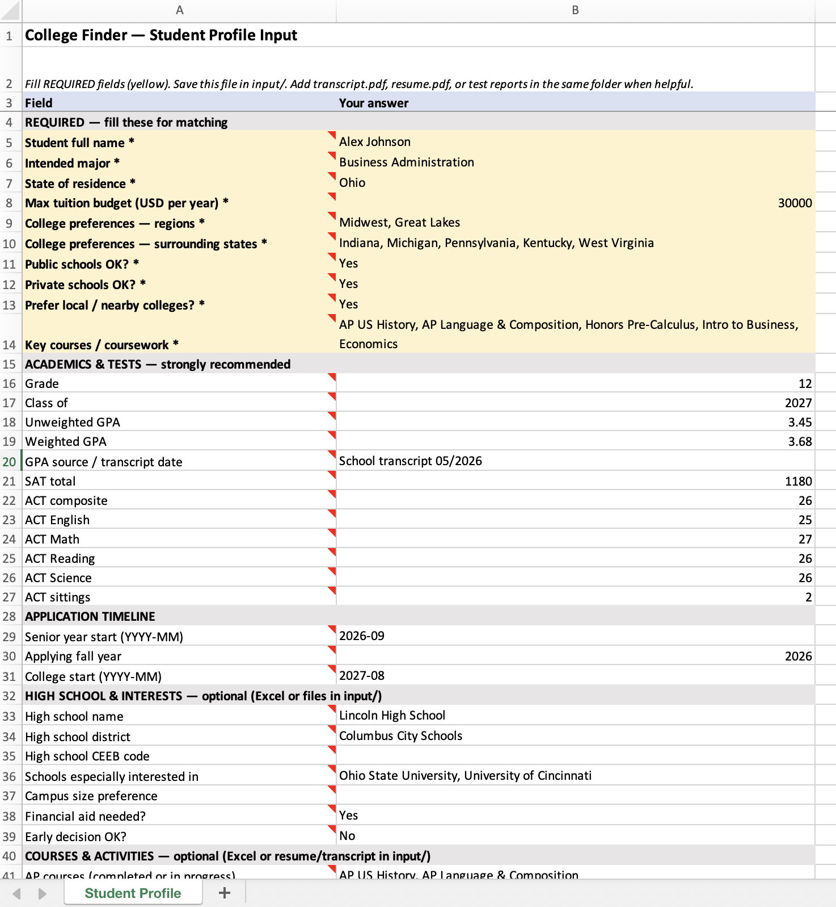
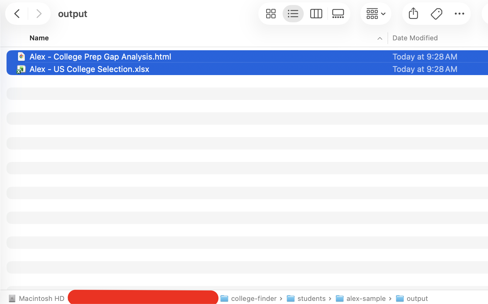
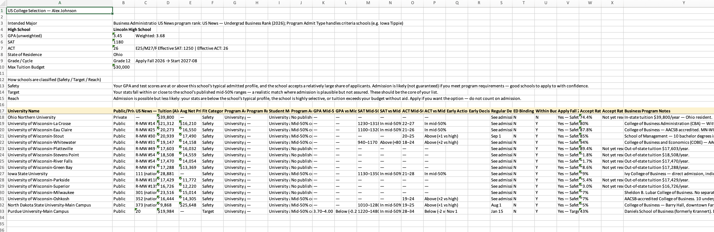
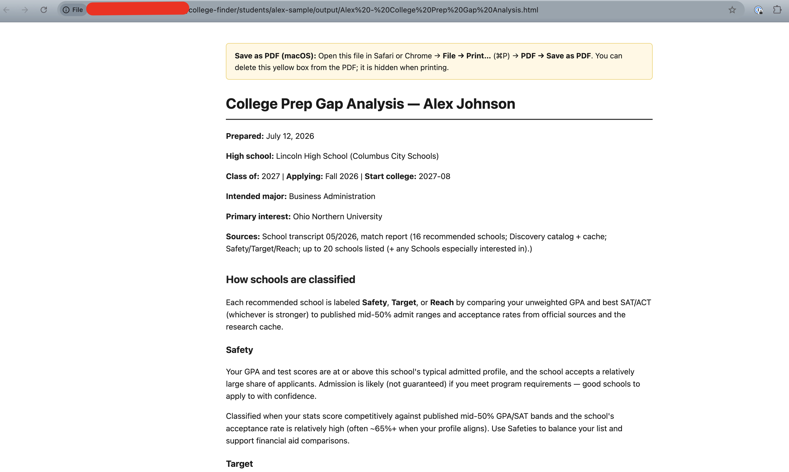
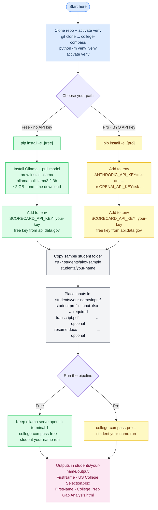

# College Compass

**A free, open-source tool that helps high school juniors and seniors — and their parents — find the right colleges.**

College admissions research is time-consuming and expensive. This tool does the research for free, on your own computer, with no data leaving your machine.

Fill in a student profile — grades, test scores, budget, state, preferred majors, and any schools you already have in mind. Run one command. The tool searches thousands of US colleges, researches each school's admissions data, and delivers:

- A **Safety / Target / Reach classification** for every matching school
- A **27-column Excel selection sheet** with rankings, tuition, average net price, acceptance rates, deadlines, and fit scores
- A **printable gap analysis report** showing exactly where the student stands against each school's admit profile

**How it works under the hood:**

- **Python scripts** handle all matching and classification — deterministic, explainable, no surprises
- **Web scraping** pulls live data from the College Scorecard API (free US government data) and university admissions pages
- **LLMs** (local Ollama model or your own API key) read those admissions pages and extract structured data — mid-50% bands, deadlines, acceptance rates — into a shared research cache
- Once a school is researched, it stays in the cache — repeat runs are instant

**Free to use. No subscription. No data sent to any service. You own everything.**

> *Python decides. Models draft. Humans validate.*

---

## How it works



### Folder structure

Every student gets their own folder under `students/`. The repo ships with a fictional example — `alex-sample` — so you can see exactly what goes where before touching real data.

```text
students/
  alex-sample/                          ← fictional example (committed to repo)
    input/
      student profile input.xlsx        ← fill this in (required)
      LINCOLN HIGH SCHOOL Transcript.pdf ← optional — any filename works
      ALEX JOHNSON-Resume.docx          ← optional — any filename works
      Plan for Senior Year.txt          ← optional — any filename works
    output/
      Alex - US College Selection.xlsx
      Alex - College Prep Gap Analysis.html
    data/
      college_matches.json              ← full S/T/R match report

  your-student/                         ← copy alex-sample, rename, fill in
    input/
      student profile input.xlsx

data/
  college_research_cache.json           ← shared across ALL students
                                           once a school is researched, it's never fetched again
```

### Step by step

| Step | What happens | What you touch |
| --- | --- | --- |
| 1. **Fill your profile** | Open `students/<name>/input/student profile input.xlsx` and enter GPA, test scores, budget, state, major, and any schools already on your list | Excel file |
| 2. **Drop in documents** | Optionally add transcript, resume, or any `.pdf`, `.docx`, or `.txt` file to the same `input/` folder — any filename works. The LLM reads them and fills any blank profile fields automatically | Input folder |
| 3. **Discover schools** | Python queries the free College Scorecard API filtered by your state, region, budget, and major. Your listed schools are always included | Automatic |
| 4. **Research each school** | For schools not yet in the cache, the LLM fetches each school's admissions page and extracts mid-50% GPA/SAT/ACT bands, acceptance rates, and deadlines into `data/college_research_cache.json` | Automatic (cached after first run) |
| 5. **Classify** | Pure Python compares your profile to each school's data → Safety, Target, or Reach | Automatic |
| 6. **Output** | 27-column Excel sheet + printable gap analysis HTML written to `students/<name>/output/` | Open and review |

The research cache is shared across all students — once a school is researched, it's saved locally and skipped on every future run.

### Sample outputs (alex-sample)

---

**📁 Input folder** — place your Excel profile and any supporting documents here:



&nbsp;

---

**📊 Student profile Excel** — fill in GPA, test scores, budget, state, and major:



&nbsp;

---

**📁 Output folder** — where your files will be generated after running:



&nbsp;

---

**📈 Excel selection sheet** — 27-column sheet with Safety/Target/Reach, tuition, net price, deadlines:



&nbsp;

---

**📋 Gap analysis report** — printable HTML showing where the student stands against each school:



&nbsp;

---

## Setup at a glance



---

## Requirements

| Requirement | Detail |
| --- | --- |
| **OS** | macOS, Linux, or Windows |
| **Python 3.9+** | Check: `python --version` · [Install guide](docs/Install-prerequisites.md#1-install-python) |
| **Git** | Check: `git --version` · [Install guide](docs/Install-prerequisites.md#2-install-git) |
| **Setup time** | ~15 minutes |
| **School discovery** | Free [College Scorecard API key](https://api.data.gov/signup/) |
| **Free path** | [Ollama](https://ollama.com/) + ~2 GB local model |
| **Pro path** | OpenAI or Anthropic API key |

---

## Install — pick one path

### Option A — Free (local AI, no API key)

Uses [Ollama](https://ollama.com/) to auto-research schools locally. No OpenAI or Anthropic account needed.

**macOS / Linux:**

```bash
git clone https://github.com/hareesh007-ship-it/college-compass college-compass
cd college-compass
python3 -m venv .venv
source .venv/bin/activate
pip install -e ".[free]"
```

**Windows (Command Prompt):**

```bat
git clone https://github.com/hareesh007-ship-it/college-compass college-compass
cd college-compass
python -m venv .venv
.venv\Scripts\activate
pip install -e ".[free]"
```

**Windows (PowerShell):**

```powershell
git clone https://github.com/hareesh007-ship-it/college-compass college-compass
cd college-compass
python -m venv .venv
Set-ExecutionPolicy -Scope Process -ExecutionPolicy RemoteSigned
.venv\Scripts\Activate.ps1
pip install -e ".[free]"
```

Install Ollama and pull the model (one time, ~2 GB):

```bash
# macOS
brew install ollama

# Windows / Linux: download from https://ollama.com/download
ollama pull llama3.2:3b
```

### Option B — Pro (bring your own API key)

Use your existing OpenAI or Anthropic subscription.

**macOS / Linux:**

```bash
git clone https://github.com/hareesh007-ship-it/college-compass college-compass
cd college-compass
python3 -m venv .venv
source .venv/bin/activate
pip install -e ".[pro]"
```

**Windows (Command Prompt):**

```bat
git clone https://github.com/hareesh007-ship-it/college-compass college-compass
cd college-compass
python -m venv .venv
.venv\Scripts\activate
pip install -e ".[pro]"
```

**Windows (PowerShell):**

```powershell
git clone https://github.com/hareesh007-ship-it/college-compass college-compass
cd college-compass
python -m venv .venv
Set-ExecutionPolicy -Scope Process -ExecutionPolicy RemoteSigned
.venv\Scripts\Activate.ps1
pip install -e ".[pro]"
```

Add your key to `.env` at the repo root.

**macOS / Linux:**

```bash
cp env.template .env
```

**Windows (Command Prompt):**

```bat
copy env.template .env
```

Then open `.env` in any text editor (Notepad on Windows works fine) and fill in your key:

```text
ANTHROPIC_API_KEY=sk-ant-...    # preferred
# or
OPENAI_API_KEY=sk-...
```

> `env.template` is a plain visible file in the repo root — no hidden file settings needed.

**Every time you open a new terminal**, activate the venv first:

- macOS/Linux: `source .venv/bin/activate`
- Windows Command Prompt: `.venv\Scripts\activate`
- Windows PowerShell: `.venv\Scripts\Activate.ps1`

---

## Add a free Scorecard key (both paths)

> **⚠️ Important:** Without this key, school discovery falls back to a shared demo key that is heavily rate-limited. You will likely see very few schools or empty results. The tool will warn you at runtime if the key is missing.

A free personal key takes 30 seconds to get. Add it to your `.env` file:

```bash
SCORECARD_API_KEY=your_key_from_api.data.gov
```

Get a free key: [api.data.gov/signup](https://api.data.gov/signup/)

---

## Try it — sample student included

The repo ships with a fictional student (`alex-sample`) so you can verify your install before entering real data.

**Free path:**

Open **terminal 1** and keep it running:

```bash
ollama serve
```

Open **terminal 2** and run the pipeline:

```bash
college-compass-free --student alex-sample run
```

**Pro path:**

```bash
college-compass-pro --student alex-sample run
```

**Output lands at:**

| File | Description |
| --- | --- |
| `students/alex-sample/output/Alex - US College Selection.xlsx` | 27-column selection sheet |
| `students/alex-sample/output/Alex - College Prep Gap Analysis.html` | Printable gap report |
| `students/alex-sample/data/college_matches.json` | Full match report (S/T/R) |

Open the Excel and gap HTML in your browser to confirm everything worked.

See [`students/alex-sample/README.md`](students/alex-sample/README.md) for the sample profile details.

---

## Add your own student

```bash
cp -r students/alex-sample students/<your-name>
# edit students/<your-name>/input/student profile input.xlsx

college-compass-free --student <your-name> run   # free path
college-compass-pro  --student <your-name> run   # pro path
```

Add real student folders to `.gitignore` so personal data is never committed:

```text
students/<your-name>/
```

See [`docs/PROFILE_AND_CONFIG.md`](docs/PROFILE_AND_CONFIG.md) for all Excel profile fields.

---

## Outputs

All paths are under `students/<name>/`:

| File | Description |
| --- | --- |
| `output/{FirstName} - US College Selection.xlsx` | 27-column sheet: rankings, tuition, net price, fit, deadlines, accept rates |
| `output/{FirstName} - College Prep Gap Analysis.html` | Printable gap report — open in browser → Print → PDF |
| `data/college_matches.json` / `.md` | Full Safety / Target / Reach report |
| `data/colleges/catalog.json` | Discovered school list for this run (generated) |

---

## Key files

| Path | Role |
| --- | --- |
| `students/<name>/input/student profile input.xlsx` | Student profile |
| `data/college_research_cache.json` | Shared research cache (rankings, tuition, mid-50%, deadlines) |
| `.env` | API keys — never committed |
| `college_compass_free.py` | Entry point for free path |
| `college_compass_pro.py` | Entry point for pro path |

---

## Cost

| Activity | Free path | Pro path |
| --- | --- | --- |
| Matcher, sheet, validator | Free (Python only) | Free (Python only) |
| School discovery (Scorecard) | Free (government API) | Free (government API) |
| Auto-research cache population | Free (local Ollama) | Your OpenAI / Anthropic API credits |
| Maintainer hosting | None | None |

---

## Documentation

| Doc | Audience |
| --- | --- |
| [`docs/Install-prerequisites.md`](docs/Install-prerequisites.md) | First-timers — install Python and Git |
| [`docs/Quickstart-free.md`](docs/Quickstart-free.md) | Free path — full setup walkthrough |
| [`docs/Quickstart-pro.md`](docs/Quickstart-pro.md) | Pro path — full setup walkthrough |
| [`docs/ARCHITECTURE.md`](docs/ARCHITECTURE.md) | Developers — pipeline, data model, module reference, architecture diagram |
| [`docs/PROFILE_AND_CONFIG.md`](docs/PROFILE_AND_CONFIG.md) | Excel profile fields + config schema |
| [`docs/RESEARCH_AGENT.md`](docs/RESEARCH_AGENT.md) | Cache editors — scope commands, validation gate |
| [`CONTRIBUTING.md`](CONTRIBUTING.md) | Contributors |
