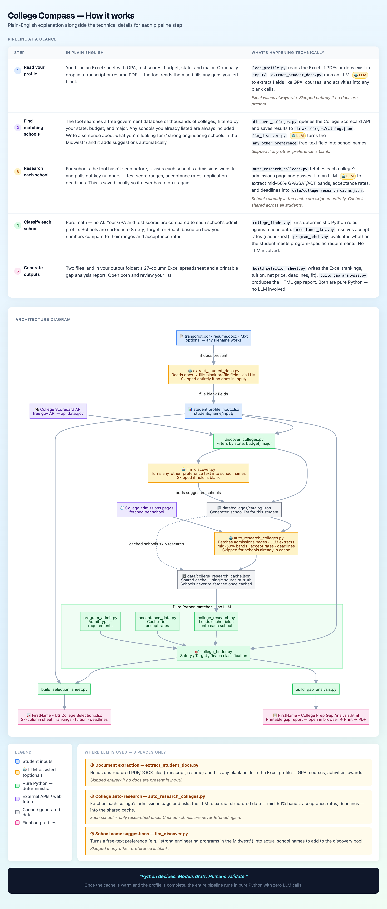

# College Compass — Architecture

**Project:** college-compass  
**Last updated:** 2026-06-28  
**Audience:** Developers, counselors, and AI agents continuing the project

This document describes the end-to-end pipeline: what reads what, what is hardcoded vs cached, and how each Excel column is populated. For research/cache editing rules, see [`RESEARCH_AGENT.md`](RESEARCH_AGENT.md). For deferred features, see [`ENHANCEMENT.md`](ENHANCEMENT.md).

---

## Pipeline at a glance



> Once the research cache is warm, the entire pipeline runs in pure Python with zero LLM calls. Repeat runs are instant.

---

## 1. Overview

The college compass is a **deterministic Python pipeline**. It does not call LLMs or re-research colleges on each run. Research lives in `data/college_research_cache.json`; matching and sheet generation are pure Python.

```
input/student profile input.xlsx
          │
          ▼
    scripts/pipeline.py
          │
          ├─► discover_colleges.py ──► data/colleges/catalog.json
          │         (Scorecard API + preferred schools)
          │
          ├─► cache_sync.py + research_colleges.py
          │         (stub + US News fill for new catalog schools)
          │
          ├─► college_finder.py ◄── data/college_research_cache.json
          │         (Safety / Target / Reach classification)
          │
          └─► build_selection_sheet.py ──► XLSX + gap HTML
```

**Run everything (recommended):**

```bash
cd ~/Documents/college-compass
college-compass run
```

**After a manual cache edit:**

```bash
college-compass validate
college-compass run
```

**Legacy equivalents (same result):**

```bash
python3 scripts/run.py         # full pipeline
python3 scripts/validate_cache.py  # validate only
```

---

## 2. Directory layout

### Entry points

| Path | Role |
|------|------|
| `college-compass` | CLI entry point — `run`, `validate`, `cursor-prompt`, `help` subcommands |
| `scripts/run.py` | Direct Python entry point — calls `pipeline.run_pipeline()` |
| `scripts/pipeline.py` | Orchestrates all stages: discover → cache sync → research → match → outputs |

### Scripts (`scripts/`)

All Python lives under `scripts/`. Shared path constants are in `scripts/_paths.py` (`ROOT`, `DATA`, `INPUT`, `OUTPUT`).

| File | Role |
|------|------|
| `_paths.py` | Project root and `input/` / `data/` / `output/` path helpers |
| `pipeline.py` | Full pipeline orchestration (`discover → sync → research → match → outputs`) |
| `run.py` | Thin entry point — calls `pipeline.run_pipeline()` |
| `load_profile.py` | Reads `input/student profile input.xlsx` into profile dict |
| `profile_fields.py` | Column name constants for profile Excel |
| `discover_colleges.py` | Scorecard API + preferred schools → `data/colleges/catalog.json` |
| `college_catalog.py` | Load / save / merge catalog JSON |
| `catalog_bootstrap.py` | Seed cache stubs from catalog for new schools; imports `MN_RECIPROCITY_STATES` from `college_finder.py` |
| `catalog_refine.py` | Post-discovery catalog quality pass |
| `cache_sync.py` | Ensure every catalog school has a cache stub |
| `research_colleges.py` | US News rank auto-fill for cache stubs |
| `llm_discover.py` | Optional LLM discovery hook — reads `research_backend` from `config/pro.json`; no-op for `cursor`/`local` |
| `college_finder.py` | Matcher — Safety/Target/Reach, filters, tuition/reciprocity, match report JSON/MD |
| `build_selection_sheet.py` | XLSX (selection + checklist + gap summary tabs) |
| `build_gap_analysis.py` | Gap analysis HTML from match report |
| `college_research.py` | Load cache, `apply_to_college()`, rankings helpers, sort key |
| `program_admit.py` | Program admit display modes, direct-admit evaluation, mid-50% "Meets?" |
| `acceptance_data.py` | Cache-first acceptance rates; `rate_for_fit()` for matcher; `display_pair()` for sheet |
| `validate_cache.py` | Schema validation, orphan-key detection, catalog cross-check |
| `output_paths.py` | Output file paths derived from student profile first name |
| `export_gap_analysis_html.py` | HTML envelope (`wrap_gap_html`) + standalone CLI — called by `build_gap_analysis.py` |
| `run_log.py` | Run log append — `output/logs/research_log.jsonl` |

### Inputs (`input/`)

| File | Role | Consumed by |
|------|------|-------------|
| `student profile input.xlsx` | GPA, tests, budget, major, state, preferences, application cycle | `load_profile.py` → pipeline |

Excel is the **only** supported input format. There is no JSON profile fallback.

HS historical outcomes (`high_school_outcomes.json`) deferred — see [`ENHANCEMENT.md`](ENHANCEMENT.md).

### Data (`data/`)

| File | Role | Status |
|------|------|--------|
| `college_research_cache.json` | **Single source of truth** — rankings, tuition, mid-50%, acceptance rates, deadlines, `admit_profile` overrides | Active |
| `colleges/catalog.json` | Discovered + preferred schools — pipeline source for school list | Active; regenerated on each run |
| `acceptance_rates.json` | Legacy acceptance-rate copy | Fallback only; `acceptance_data.py` reads cache first |
| `us_news_rankings_2026.json` | Deprecated rankings stub | Empty; rankings live in cache |

### Outputs (`output/`)

| File | Producer | Notes |
|------|----------|-------|
| `college_matches.json` | `college_finder.py` (refreshed by pipeline) | Full match report per college |
| `college_matches.md` | `college_finder.py` | Human-readable match summary |
| `{FirstName} - US College Selection.xlsx` | `build_selection_sheet.py` | One tab: `College Selection - {Major}` |
| `{FirstName} - College Prep Gap Analysis.html` | `build_gap_analysis.py` | Printable HTML gap report (single-major run) |
| `{FirstName} - College Prep Gap Analysis.html` | `build_gap_analysis.py` | Printable HTML gap report (open in browser → Print → PDF) |
| `logs/research_log.jsonl` | `run_log.py` | Pipeline run history (gitignored) |

Output filenames are parameterized from the profile first name via `output_paths.py`.

### Research assist (`research_assist/`)

Optional free/offline tier using Ollama — **not part of the main pipeline**.

| File | Role |
|------|------|
| `extract_college_draft.py` | Paste admissions text → draft cache-schema JSON (stdout only, no cache writes) |
| `README.md` | Install guide, model options, workflow |

See `install-free.sh` to set up (installs `.[free]` from `pyproject.toml`).

---

## 3. End-to-end data flow

```mermaid
flowchart TB
    subgraph inputs [Inputs]
        P[input/student profile input.xlsx]
    end

    subgraph discovery [Discovery]
        SC[Scorecard API]
        DI[discover_colleges.py]
        CB[catalog_bootstrap.py / catalog_refine.py]
        CAT[data/colleges/catalog.json]
    end

    subgraph research [Cache maintenance]
        CS[cache_sync.py]
        RC[research_colleges.py]
        C[data/college_research_cache.json]
    end

    subgraph core [Matcher]
        CF[college_finder.py]
        CR[college_research.py]
        AD[acceptance_data.py]
        PA[program_admit.py]
    end

    subgraph outputs [Outputs]
        MJ[college_matches.json / .md]
        SH[{FirstName} - US College Selection.xlsx]
        GH[{FirstName} - College Prep Gap Analysis.html]
    end

    P --> DI
    SC -.->|optional API| DI
    DI --> CAT
    CB --> CAT
    CAT --> CS
    CS --> C
    RC --> C
    P --> CF
    C --> CR
    CR --> CF
    CR --> AD
    AD --> CF
    PA --> CF
    CF --> MJ
    CF --> SH
    P --> SH
    MJ --> GH
```

### Stage-by-stage

1. **Load profile** — `load_profile()` reads `input/student profile input.xlsx`. Effective SAT/ACT = max of submitted score and ACT↔SAT concordance (`ACT_TO_SAT` in `college_finder.py`).

2. **Discover schools** — `discover_colleges()` queries the College Scorecard API filtered by profile criteria (state, major, budget). Preferred schools are always included. Result saved to `data/colleges/catalog.json`. Falls back to existing catalog if API is unavailable.

3. **Bootstrap + refine catalog** — `catalog_bootstrap.py` seeds cache stubs for schools not yet in cache; `catalog_refine.py` applies quality filters.

4. **Cache sync** — `cache_sync.py` ensures every catalog school has a cache entry (stub or full). `research_colleges.py` fills US News ranks for stubs that have none.

5. **Cache overlay** — For each college, `apply_to_college()` (`college_research.py`) merges cache fields over the seed `College` dataclass: tuition, `admit_stats` mid-50%, acceptance rates, deadlines, `business_program_note`. Cache wins when present.

6. **Filters** — `passes_filters()` applies state/region preferences, public/private toggles, budget, and business-program requirement. Failures go to the `excluded` list (still appear on sheet).

7. **Tuition for student** — `tuition_for_student()` applies in-state pricing and **MN reciprocity** (WI, ND, SD publics pay in-state rate when home state is Minnesota). Reciprocity rules defined once in `college_finder.py`; imported by `catalog_bootstrap.py`.

8. **Fit rate for matching** — `rate_for_fit()` (`acceptance_data.py`) prefers `acceptance_rates.business_program`, then `business_program_secondary` with `use_for_fit: true` (used by Carlson — no direct business admit rate published), then `university_general`. Falls back to seed `College` rates if cache missing.

9. **Admit stats resolution** — `resolve_admit_stats()` uses published mid-50% from cache when available; otherwise point estimates from seed. Point estimates drive matching but **do not appear on the sheet** when cache has bands.

10. **Safety / Target / Reach** — `classify_fit()` compares student GPA/SAT to medians/mid-50%, acceptance rate, and US News national rank (top-10 → Reach). Thresholds are hardcoded in `college_finder.py`.

11. **Program admit columns** — `resolve_program_admit()` (`program_admit.py`) sets display mode, requirements, and "Meets?" per school. Defaults in `DEFAULT_ADMIT_PROFILES`; cache `admit_profile` merges over defaults.

12. **Rankings on match entry** — `college_rankings()` adds US News fields and source string from cache.

13. **Sheet + gap HTML** — `build_selection_sheet.py` sorts entries (recommended first, priority-interest schools first), maps columns via `build_row()`, writes XLSX plus checklist and gap-summary tabs. `build_gap_analysis.py` produces the standalone HTML gap report.

---

## 4. Hardcoded vs cache

### Hardcoded in Python (change requires code edit)

| Item | Location | Notes |
|------|----------|-------|
| Dynamic college catalog | `discover_colleges.py` → `data/colleges/catalog.json` | Driven by profile + Scorecard API; preferred schools always included |
| Seed `College` dataclass fields | `college_finder.py` → `COLLEGES` | Baseline tuition, point estimates, deadlines — overwritten by cache when present |
| MN reciprocity states | `college_finder.py` → `MN_RECIPROCITY_STATES` | WI, ND, SD publics for MN residents; imported by `catalog_bootstrap.py` |
| Local/surrounding state filter | `college_finder.py` → `LOCAL_STATES`, profile `preferences` | Region gating |
| ACT↔SAT concordance | `college_finder.py` → `ACT_TO_SAT`, `sat_to_act_equiv()` | Effective test scores |
| Safety/Target/Reach thresholds | `college_finder.py` → `classify_fit()` | Score deltas, acceptance-rate cutoffs, top-10 national = Reach |
| Program admit defaults | `program_admit.py` → `DEFAULT_ADMIT_PROFILES` | Overridden per school by cache `admit_profile` |
| Display mode labels | `program_admit.py` → `DISPLAY_MODE_LABELS` | Sheet column 6 text |
| Major → rank column header | `college_research.py` → `us_news_column_label()` | Entrepreneurship vs undergrad business |
| Output paths | `output_paths.py` | Derived from profile first name — parameterized |
| Gap analysis summary tab | `build_selection_sheet.py` → `build_gap_summary_rows()` | Profile-specific bullets |
| Checklist global tasks | `build_selection_sheet.py` → `build_checklist_rows()` | Common App / testing reminders |

### Read from cache (edit via `docs/RESEARCH_AGENT.md`)

| Item | Cache path | Applied by |
|------|------------|------------|
| US News rankings (national, business, entrepreneurship, regional) | `colleges.*.rankings` | `college_rankings()`, sheet col 3 |
| Rankings source note | root `rankings_source` | Sheet col 29 |
| Tuition in/out of state | `colleges.*.tuition` | `apply_to_college()` → `tuition_for_student()` |
| Program mid-50% (GPA/SAT/ACT) | `colleges.*.admit_stats` | `apply_to_college()` → sheet cols 10–15 |
| Acceptance rates (general + business + secondary) | `colleges.*.acceptance_rates` | `acceptance_data.py`, matcher fit rate, sheet cols 22–23 |
| Deadlines (EA/ED/Regular, ED flag) | `colleges.*.deadlines` | `apply_to_college()`, sheet cols 16–19 |
| Business program note | `colleges.*.business_program_note` | Matcher reasons, sheet col 27 fallback |
| Program admit override | `colleges.*.admit_profile` | `program_admit.py` → sheet cols 6–9 |

**Precedence:** cache overlay → seed `COLLEGES` → matcher fallbacks. Never duplicate research into `college_finder.py` unless intentionally changing seed defaults.

---

## 5. Cache entries and orphan policy

The cache contains **two classes of entries**:

### Active entries (match catalog)
Schools whose key exactly matches a catalog entry in `data/colleges/catalog.json`. These fully participate in the pipeline — cache fields override seed values.

### Legacy orphan entries
~20 entries with old-style keys (e.g. `"Augsburg University (Business Administration)"`, `"Indiana University Bloomington (Kelley School of Business)"`) from the original hardcoded 21-school list. They do **not** match any catalog key, so they are never loaded by the matcher. The validator emits `WARN: Cache entry not in catalog` for each.

**Policy:** Keep legacy orphans in cache as a reference archive. They do not affect pipeline output. If a legacy school re-enters the catalog (via discovery), rename its cache key to match exactly and re-run `validate_cache.py`.

**Key rule:** Cache keys must match catalog keys **exactly** — no trailing school names or parenthetical suffixes.

---

## 6. Legacy files

| File | Status | Behavior today | Retirement plan |
|------|--------|----------------|-----------------|
| `data/college_research_cache.json` | **Authoritative** | All active research | Keep; only write target for agents |
| `data/acceptance_rates.json` | Legacy | `acceptance_data.load_acceptance_data()` uses cache first; reads this file only if cache import fails | Optional merge into cache; then delete |
| `data/us_news_rankings_2026.json` | Deprecated | Empty stub with `_deprecated` note | Safe to ignore; rankings only in cache |
| `archive/crawl_video.py` | Archived | One-off YouTube crawl — not part of pipeline | Archived; not runnable without separate deps |

---

## 7. Column map

Column order is defined in `build_selection_sheet.py` → `sheet_columns()`. Column 3 header is **major-aware** (e.g. "US News — Entrepreneurship Rank (2026)" for an entrepreneurship major).

| # | Column header | Sheet value source | Python origin | Primary data |
|---|---------------|-------------------|---------------|--------------|
| 1 | University Name | `entry["name"]` | `match_colleges()` | `COLLEGES[].name` |
| 2 | Public/Private | `entry["public_private"]` | `match_colleges()` | Seed (not in cache) |
| 3 | US News — *Program* Rank (2026) | `program_rank_for_major(entry, major)` | `build_row()` → `college_research.py` | Cache `rankings.*` |
| 4 | Tuition (Student) | `entry["tuition_estimate"]` | `tuition_for_student()` after cache overlay | Cache `tuition` + reciprocity logic |
| 5 | Avg Net Price (Scorecard) | `entry["avg_net_price"]` | `match_colleges()` → catalog `avg_net_price` | Scorecard `latest.cost.avg_net_price` |
| 6 | Fit Category | `entry["category"]` or `Excluded` | `classify_fit()` | Matcher (uses cache rates + mid-50%) |
| 7 | Program Admit Type | `entry["program_admit_type"]` | `resolve_program_admit()` | `program_admit.py` defaults + cache `admit_profile` |
| 8 | Program Requirements | `entry["program_requirements"]` | `resolve_program_admit()` | Direct-admit criteria or `—` |
| 9 | Student Meets Program Req? | `entry["student_meets_program_req"]` | `resolve_program_admit()` | Profile vs mid-50% or direct-admit rules |
| 10 | Program Admit Notes | `entry["program_admit_notes"]` | `resolve_program_admit()` | Defaults + cache `admit_profile.program_admit_notes` |
| 11 | GPA Mid-50% Range | `entry["gpa_range_display"]` or `—` | `resolve_admit_stats()` | Cache `admit_stats` or blank |
| 12 | GPA vs Mid-50% | `entry["gpa_position"]` | `mid50_position()` in matcher | Profile GPA vs cache band |
| 13 | SAT Mid-50% Range | `entry["sat_range_display"]` or `—` | `resolve_admit_stats()` | Cache `admit_stats` or blank |
| 14 | SAT vs Mid-50% (effective) | `entry["sat_position"]` | `mid50_position()` | Effective SAT vs cache band |
| 15 | ACT Mid-50% Range | `entry["act_range_display"]` or `—` | `resolve_admit_stats()` | Cache `admit_stats` or blank |
| 16 | ACT vs Mid-50% (effective) | `entry["act_position"]` | `mid50_position()` | Effective ACT vs cache band |
| 17 | Early Action Deadline | `deadlines.early_action` | `match_colleges()` → cache overlay | Cache `deadlines.early_action` |
| 18 | Early Decision Deadline | `deadlines.early_decision` | Same | Cache `deadlines.early_decision` |
| 19 | Regular Decision Deadline | `deadlines.regular` | Same | Cache `deadlines.regular` |
| 20 | ED Binding | `Y`/`N` from ED deadline + `early_decision_available` | `build_row()` | Cache `deadlines.ed_available` |
| 21 | Within Budget | `Y`/`N` from `within_budget` | `tuition_for_student()` vs profile budget | Profile + cache tuition |
| 22 | Apply Fall 2026 | `apply_recommendation(entry)` | `scripts/build_selection_sheet.py` | Category + excluded + priority interest |
| 23 | Accept Rate (University General) | `display_pair(name)[0]` | `scripts/acceptance_data.py` | Cache `acceptance_rates.university_general` |
| 24 | Accept Rate (*Program*) | `display_pair(name)[1]` | `accept_rate_program_column_label(major)` + `acceptance_data.py` | Cache `acceptance_rates.business_program` (+ secondary display) |
| 25 | Business Program Notes | Matcher `reasons` / `exclusion_reasons` heuristics | `build_row()` | Cache `business_program_note` via matcher reasons |
| 26 | Accept Rate Source | `display_pair(name)[2]` | `scripts/acceptance_data.py` | Cache rate `source_url` / `source_note` |
| 27 | US News Rankings Source | `entry["us_news_rankings_source"]` | `college_rankings()` | Cache root `rankings_source` |

### Columns intentionally blank today
- **10–15 (mid-50%)** — Blank (`—`) for schools with no official program-level band in cache (by design).

### Excel tabs

| Tab | Source function | Content |
|-----|-----------------|---------|
| `College Selection - {Major}` | `write_xlsx()` | Profile header block + 27-column match table |

### Matcher notes

- **School list cap:** Up to `MAX_LISTED_SCHOOLS = 20` schools listed. Schools in `schools_interested_in` are always kept regardless of cap.
- **Carlson fit rate:** Carlson has no direct-admit business rate; matcher uses `acceptance_rates.business_program_secondary` with `use_for_fit: true` in cache — not the UW pre-business secondary rate.
- **MN reciprocity:** WI, ND, SD publics receive in-state tuition for MN residents (`MN_RECIPROCITY_STATES` in `college_finder.py`, imported by `catalog_bootstrap.py`).
- **Mid-50% blank:** `—` displayed when no official program-level band is published — intentional, not a bug.

---

## 8. Module reference

| Module | Responsibility |
|--------|----------------|
| `scripts/pipeline.py` | End-to-end orchestration: discover → sync → research → match → outputs |
| `scripts/college_finder.py` | Profile load, `COLLEGES` seed, filters, tuition/reciprocity, fit classification, match report JSON/MD |
| `scripts/college_research.py` | Load cache, `apply_to_college()`, rankings helpers, sort key for sheet order |
| `scripts/program_admit.py` | Program admit display modes, direct-admit evaluation, mid-50% "Meets?" summary |
| `scripts/acceptance_data.py` | Cache-first acceptance rates; `rate_for_fit()` for matcher; `display_pair()` for sheet |
| `scripts/build_selection_sheet.py` | XLSX with major-named tab |
| `scripts/build_gap_analysis.py` | Gap analysis HTML from match report |
| `scripts/discover_colleges.py` | Scorecard API + preferred schools → catalog |
| `scripts/cache_sync.py` | Ensure catalog school has cache stub |
| `scripts/research_colleges.py` | US News rank fill for stubs |
| `scripts/validate_cache.py` | Schema validation, orphan-key detection, catalog cross-check |
| `scripts/output_paths.py` | Output paths derived from profile first name |
| `research_assist/extract_college_draft.py` | Ollama-backed JSON draft extractor (offline, draft only) |

---

## 9. Program admit display modes

Defaults in `program_admit.py`; cache `admit_profile.display_mode` overrides.

| Mode | Example schools | Sheet behavior |
|------|-----------------|----------------|
| `mid50_band` | Carlson, Purdue, UIUC Gies | Requirements `—`; Meets? from mid-50% bands |
| `mid50_partial` | Wisconsin, UIC, St Thomas | Same; notes explain missing GPA band |
| `direct_admit_criteria` | Iowa Tippie | Requirements show GPA/test mins; Meets? Yes/Partial/No |
| `holistic_no_stats` | Kelley, Bethel, Augsburg, CMU Tepper | Meets? = "Review holistically" |
| `pathway` | Mankato, Iowa State | Meets? = "Pre-business / apply later" |
| `university_only` | Winona, NDSU, UWEC, etc. | Meets? = "University admit only" |
| `not_applicable` | MIT, Stanford | Meets? = "N/A" |

---

## 10. Matcher ↔ cache contract

- Every name in `COLLEGES` should have a matching key in `cache.colleges` (validator warns on mismatch).
- College keys must match **exactly** — see name list in [`RESEARCH_AGENT.md`](RESEARCH_AGENT.md) §3.
- Cache keys must match catalog keys exactly — no parenthetical school-name suffixes.
- `admit_profile` must be **nested under the college entry**, never a sibling key at `colleges` top level.
- After cache edits: `python3 scripts/validate_cache.py` → regenerate outputs.

---

## 11. Phase 3 migration notes (not implemented)

Planned enhancements (see [`ENHANCEMENT.md`](ENHANCEMENT.md)):

- Generic profile schema + validation CLI
- Config-driven reciprocity (not MN-only hardcode)
- `examples/` student folder with committed sample outputs

Already completed:
- ✅ Dynamic catalog (`discover_colleges.py` + `data/colleges/catalog.json`)
- ✅ Parameterized output filenames (`output_paths.py`)
- ✅ Excel-only profile (JSON fallback removed)
- ✅ `LICENSE`, `CONTRIBUTING.md`, `README.md`

---

## Related documents

| Document | Purpose |
|----------|---------|
| [`ENHANCEMENT.md`](ENHANCEMENT.md) | Deferred features |
| [`RESEARCH_AGENT.md`](RESEARCH_AGENT.md) | Cache schema, scope commands, validation gate |
| [`ARCHITECTURE.md`](ARCHITECTURE.md) | This document — pipeline, data model, module reference |
| [`../CONTRIBUTING.md`](../CONTRIBUTING.md) | How to contribute |
