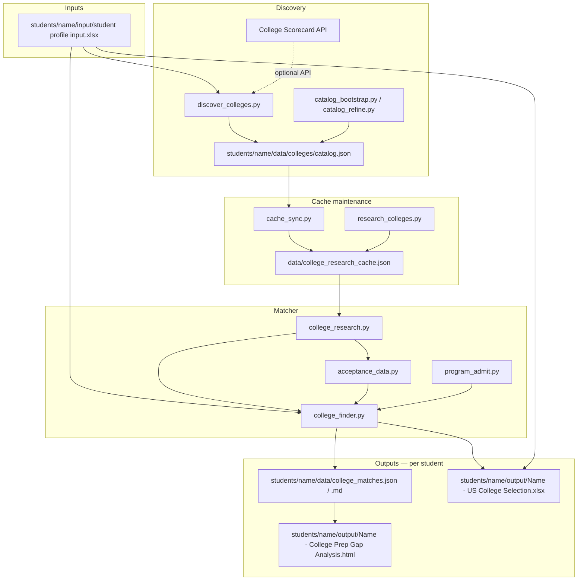

# College Compass — Technical Reference

**Audience:** Developers and technically curious users who want to understand how the pipeline works, how data flows through the system, and how to extend or adapt the tool.  
**Last updated:** 2026-06-28

For the cache research workflow, see [`RESEARCH_AGENT.md`](RESEARCH_AGENT.md).  
For the student profile schema, see [`PROFILE_AND_CONFIG.md`](PROFILE_AND_CONFIG.md).

---

## Table of contents

1. [Architecture overview](#1-architecture-overview)
2. [Directory layout](#2-directory-layout)
3. [Pipeline — stage by stage](#3-pipeline--stage-by-stage)
4. [Data model](#4-data-model)
5. [Safety / Target / Reach classification](#5-safety--target--reach-classification)
6. [Research cache](#6-research-cache)
7. [Two install tiers](#7-two-install-tiers)
8. [Multi-student layout](#8-multi-student-layout)
9. [Configuration](#9-configuration)
10. [Module reference](#10-module-reference)
11. [Extending the tool](#11-extending-the-tool)

---

## 1. Architecture overview

College Compass is a **deterministic Python pipeline**. It does not call LLMs or re-research schools on every run. Research lives in a JSON cache; matching and sheet generation are pure Python.

```
students/<name>/input/student profile input.xlsx
        │
        ▼
  scripts/pipeline.py
        │
        ├─► discover_colleges.py ──► students/<name>/data/colleges/catalog.json
        │         (Scorecard API + preferred schools)
        │
        ├─► cache_sync.py + research_colleges.py
        │         (stub missing entries + fill US News ranks)
        │                    ▼
        │         data/college_research_cache.json  (shared)
        │
        ├─► college_finder.py ◄── cache overlay
        │         (Safety / Target / Reach classification)
        │
        └─► build_selection_sheet.py + build_gap_analysis.py
                  ▼
        students/<name>/output/  (XLSX + gap HTML)
        students/<name>/data/    (match report JSON/MD)
```

**Core principle:** *Python decides. Models draft. Humans validate.*

LLMs are used out-of-band to populate `data/college_research_cache.json`. Every cache write must pass `validate_cache.py` before it is used by the matcher.

---

## 2. Directory layout

### Shared vs per-student

| Scope | Paths | Notes |
|-------|-------|-------|
| **Per-student** | `students/<name>/input/`, `output/`, `data/` | Profile, deliverables, catalog, match report, logs |
| **Shared (repo root)** | `data/college_research_cache.json`, `config/pro.json`, `.env` | Research cache reused by all students; tool config once per install |

Path resolution is in `scripts/_paths.py`. Set the active student with:

```bash
college-compass --student <name> run          # recommended
export COLLEGE_COMPASS_STUDENT=<name>         # shell default
COLLEGE_COMPASS_STUDENT_DIR=/abs/path/to/student  # absolute override
```

**Legacy fallback:** if no student is selected and `input/student profile input.xlsx` exists at the repo root, the pipeline uses the repo root as the student folder (backward compatibility only — do not use for new installs).

**Windows:** `python college_compass_cli.py --student <name> run` (or `pip install -e .` then `college-compass --student <name> run`).

```
college-compass/
├── college_compass_cli.py           # cross-platform CLI (Windows, pip entry point)
├── college_compass_free.py          # entry point: college-compass-free
├── college_compass_pro.py           # entry point: college-compass-pro
├── students/
│   ├── alex-sample/                # fictional example — safe to run
│   │   ├── input/                  # student profile input.xlsx
│   │   ├── output/                 # XLSX + gap HTML (deliverables)
│   │   └── data/                   # catalog, match report, logs (intermediate)
│   └── <your-student>/             # your folder (gitignore if real PII)
├── scripts/                        # all Python pipeline code
├── research_assist/                # optional Free-tier Ollama extract helper
├── data/
│   └── college_research_cache.json # shared research cache
├── config/
│   ├── pro.json.example            # template (committed)
│   └── pro.json                    # runtime config (gitignored)
├── docs/
│   ├── TECHNICAL.md                # this file
│   ├── Quickstart-pro.md
│   ├── Quickstart-free.md
│   └── RESEARCH_AGENT.md
├── install-pro.sh
├── install-free.sh
├── pyproject.toml
└── .env.example
```

### Entry points

| Command | What it does |
|---------|-------------|
| `college-compass --student <name> run` | Full pipeline for one student |
| `college-compass --student <name> validate` | Cache validation only |
| `college-compass cursor-prompt` | Print Cursor research starter |
| `python college_compass_cli.py --student <name> run` | Same as above — Windows fallback |
| `python3 scripts/run.py` | Direct Python entry (requires student env var set) |

---

## 3. Pipeline — stage by stage



### Stage details

**1. Load profile**  
`load_profile.py` reads the student Excel file into a profile dict. Effective SAT/ACT is the max of the submitted score and an ACT↔SAT concordance conversion (`ACT_TO_SAT` in `college_finder.py`).

**2. Discover schools**  
`discover_colleges.py` queries the [College Scorecard API](https://collegescorecard.ed.gov/) filtered by profile criteria (state, region, budget, major). Preferred schools (from the "Schools especially interested in" Excel field) are always included regardless of filters. Result saved to `students/<name>/data/colleges/catalog.json`. Falls back to the existing catalog if the API is unavailable.

**3. Bootstrap + refine catalog**  
`catalog_bootstrap.py` seeds cache stubs for newly discovered schools not yet in the cache. `catalog_refine.py` re-scores catalog entries using US News ranks already in the cache, removing obvious low-quality results.

**4. Cache sync**  
`cache_sync.py` ensures every catalog school has at least a stub entry in the research cache. `research_colleges.py` fills US News ranks for stubs that have none.

**5. Cache overlay**  
For each college, `apply_to_college()` (`college_research.py`) merges researched fields over the seed `College` dataclass: tuition, mid-50% GPA/SAT/ACT bands, acceptance rates, deadlines, business program notes. Cache values always win when present.

**6. Filters**  
`passes_filters()` applies state/region preferences, public/private toggles, budget ceiling, and business-program requirement. Filtered-out schools still appear on the sheet in an "Excluded" row with the reason.

**7. Tuition for student**  
`tuition_for_student()` selects in-state or out-of-state tuition. State reciprocity agreements (e.g. Minnesota residents pay in-state rates at Wisconsin, North Dakota, South Dakota public universities) are applied here.

**8. Fit rate selection**  
`rate_for_fit()` (`acceptance_data.py`) selects the most relevant acceptance rate for matching: business-program rate first, then a secondary program rate if flagged `use_for_fit: true`, then the university-wide rate.

**9. Admit stats resolution**  
`resolve_admit_stats()` uses published mid-50% ranges from cache when available, otherwise uses point estimates from the seed. Point estimates drive matching but are not displayed when official bands are present.

**10. Safety / Target / Reach classification**  
`classify_fit()` compares student GPA/SAT to medians and mid-50% ranges, acceptance rate, and US News national rank (top 10 → always Reach). See [§5](#5-safety--target--reach-classification) for threshold details.

**11. Program admit columns**  
`resolve_program_admit()` (`program_admit.py`) sets the display mode, requirements, and "Student meets?" evaluation per school. Defaults are set per display mode; the cache `admit_profile` field merges over defaults per school.

**12. Sheet + gap HTML**  
`build_selection_sheet.py` sorts entries (recommended schools first, then interest-listed schools), maps all 26 columns, and writes the XLSX. `build_gap_analysis.py` produces the standalone HTML gap report from the same match data.

---

## 4. Data model

### Student profile (Excel input)

The Excel file (`student profile input.xlsx`) is the only supported input format. Key fields:

| Field | Used for |
|-------|---------|
| GPA (unweighted) | Fit classification, "meets program req?" |
| SAT / ACT | Fit classification, mid-50% comparison |
| State of residence | In-state tuition, reciprocity, discovery filter |
| Budget (max tuition/year) | Discovery filter, "within budget?" column |
| Intended major | Business-program filter, program admit logic, sheet column headers |
| Schools especially interested in | Always included in catalog, always kept in output |
| Preferences (regions, public/private) | Discovery and filter stage |

Full schema: [`docs/PROFILE_AND_CONFIG.md`](PROFILE_AND_CONFIG.md).

### Research cache (`data/college_research_cache.json`)

The single source of truth for school data. Structured as:

```json
{
  "colleges": {
    "University of Minnesota Twin Cities": {
      "tuition": { "in_state": 15000, "out_of_state": 32000 },
      "admit_stats": {
        "gpa_range": [3.5, 3.9],
        "sat_range": [1230, 1450],
        "act_range": [27, 32]
      },
      "acceptance_rates": {
        "university_general": { "rate": 0.57, "source_url": "..." },
        "business_program": { "rate": 0.45, "source_note": "Carlson direct admit" }
      },
      "deadlines": {
        "early_action": "Nov 1",
        "regular": "Jan 15",
        "ed_available": false
      },
      "rankings": {
        "national_university": 181,
        "business_undergraduate": 42
      },
      "admit_profile": {
        "display_mode": "mid50_band",
        "program_admit_notes": "..."
      },
      "research_method": "manual",
      "last_updated": "2026-06"
    }
  },
  "rankings_source": "US News Best Colleges 2026"
}
```

Cache keys must match catalog `cache_key` values exactly. See [`RESEARCH_AGENT.md`](RESEARCH_AGENT.md) for the edit workflow.

### Catalog (`students/<name>/data/colleges/catalog.json`)

Generated per run. Lists each discovered school with its Scorecard metadata and `cache_key`. This file is gitignored — it is regenerated from the profile + Scorecard API on every run.

### Outputs

Paths are relative to `students/<name>/`:

| File | Location | Producer | Role |
|------|----------|----------|------|
| `{FirstName} - US College Selection.xlsx` | `output/` | `build_selection_sheet.py` | Deliverable |
| `{FirstName} - College Prep Gap Analysis.html` | `output/` | `build_gap_analysis.py` | Deliverable |
| `college_matches.json` / `.md` | `data/` | `college_finder.py` | Intermediate match report |
| `colleges/catalog.json` | `data/colleges/` | `discover_colleges.py` | Generated catalog (gitignored) |
| `logs/research_log.jsonl` | `data/logs/` | `run_log.py` | Audit trail (gitignored) |

---

## 5. Safety / Target / Reach classification

`classify_fit()` in `college_finder.py` determines each school's category using three factors:

### GPA and test score comparison

The matcher compares the student's GPA and effective SAT (max of submitted SAT and ACT-converted-to-SAT) against the school's published mid-50% ranges (from cache) or point estimates (from seed):

- **Safety:** student is above the median on both GPA and SAT
- **Target:** student is within the mid-50% range
- **Reach:** student is at or below the 25th percentile, or the acceptance rate is very low

### Acceptance rate cutoffs

High-selectivity schools (acceptance rate ≤ ~15%) are classified as Reach regardless of test scores.

### US News national rank

Schools ranked in the national top 10 are always classified as Reach, regardless of the student's stats.

### Fit rate selection

The rate used for classification prefers the business-program rate when available (more relevant for business majors), falling back to the university-wide general rate.

### Output cap

Up to 20 schools are listed per run. Schools from "Schools especially interested in" are always included regardless of the cap.

---

## 6. Research cache

### Why the cache exists

The pipeline runs fast and deterministically because all school data is pre-researched and stored in a JSON file. You research a school once; every run after that is instant.

### Cache vs. seed values

Every school has a **seed** in `college_finder.py` — a `College` dataclass with baseline tuition estimates, point-estimate test scores, and basic deadlines. Cache values overlay the seed: when a cache field is present, it wins. This means:

- Adding a school to the cache improves match quality immediately
- The matcher still works for schools with only a stub (seed values are used as fallback)
- You never lose data by having an incomplete cache

### Cache validation

Before the matcher uses the cache, `validate_cache.py` checks:

- Required fields are present and correctly typed
- `admit_profile` is nested under the college entry (not a sibling key)
- Cache keys match catalog keys exactly
- No duplicate keys

Run it after any manual edit:

```bash
college-compass --student <name> validate
```

### Adding research for a new school

See [`RESEARCH_AGENT.md`](RESEARCH_AGENT.md) for scope commands and the full workflow. The short version:

1. Run the pipeline — new schools get stub entries automatically
2. Use `research school: <name>` in your LLM tool to populate the stub
3. Paste the JSON into the cache
4. Validate, then re-run

---

## 7. Two install tiers

Both tiers share the same Python pipeline. They differ only in the research backend.

### Option A — Free (Ollama)

`research_assist/extract_college_draft.py` takes pasted admissions page text and outputs a draft JSON block for the cache. You review and merge manually.

```bash
# Paste admissions page text, then:
pbpaste | python3 research_assist/extract_college_draft.py --college "School Name"
# → review draft, merge into data/college_research_cache.json
college-compass --student <name> validate
college-compass --student <name> run
```

The Ollama model runs locally. No API keys. No data leaves your machine.

### Option B — Pro (BYO LLM)

`llm_discover.py` can call OpenAI or Anthropic during school discovery when "Any other preference" is filled in the profile. Per-school deep research is done interactively via Cursor using [`RESEARCH_AGENT.md`](RESEARCH_AGENT.md).

```bash
college-compass --student <name> cursor-prompt
# → prints a scoped starter prompt for a Cursor chat
```

Set `research_backend` in `config/pro.json` (`cursor`, `openai`, or `anthropic`).

### Capability comparison

| Dimension | Option A (free/local) | Option B (Pro/BYO LLM) |
|-----------|----------------------|------------------------|
| Cost | $0 after model download | Your existing subscription |
| Web search quality | Basic (DDG + page fetch) | Stronger (frontier models) |
| Business-program scope | More manual review | Better out of the box |
| US News specialty ranks | Often manual | Easier with agent |
| Time per school | Higher | Lower |
| Privacy | Fully local | Profile may go to vendor |
| Disk (first setup) | ~2–5 GB with model | No model required |

Both tiers produce the same output shape (cache schema → validator → sheet columns).

---

## 8. Multi-student layout

Each student gets their own folder under `students/`:

```
students/
  alex-sample/      # fictional example (committed, safe to run)
  <your-name>/      # your student (gitignore if real PII)
    input/
      student profile input.xlsx
    output/         # deliverables: XLSX, gap HTML
    data/
      college_matches.json / .md
      colleges/catalog.json    # generated per run (gitignored)
      logs/research_log.jsonl  # when logging enabled (gitignored)
```

Shared at repo root:

```
data/college_research_cache.json   # research cache — shared across students
config/pro.json                    # tool config (gitignored)
.env                               # API keys (gitignored)
```

The shared research cache (`data/college_research_cache.json`) lives at the repo root and is reused by all students. A school researched for one student is automatically available for another.

To add a new student:

```bash
cp -r students/alex-sample students/<name>
# edit students/<name>/input/student profile input.xlsx
college-compass --student <name> run
```

Real student folders should be gitignored — add a line to `.gitignore`:

```
students/<name>/
```

---

## 9. Configuration

### `.env`

```bash
SCORECARD_API_KEY=   # required for reliable school discovery (free at api.data.gov)
OPENAI_API_KEY=      # optional — LLM-assisted discovery only
ANTHROPIC_API_KEY=   # optional
```

Copy `.env.example` → `.env`. Never commit `.env`.

### `config/pro.json`

Shared tool config at the repo root (created by `install-pro.sh`). Key fields:

```json
{
  "research_backend": "cursor",
  "logging": {
    "enabled": true,
    "path": "data/logs/research_log.jsonl",
    "level": "info"
  }
}
```

`logging.path` is resolved relative to the **active student folder** (`scripts/pro_config.py`), so the default writes to `students/<name>/data/logs/research_log.jsonl`.

### College Scorecard API key

Free from [api.data.gov/signup](https://api.data.gov/signup/). Without your own key, the pipeline uses a shared `DEMO_KEY` that hits rate limits quickly (HTTP 429). Always use your own key for reliable discovery.

Fallback order: `SCORECARD_API_KEY` → `COLLEGE_SCORECARD_API_KEY` → shared `DEMO_KEY`.

---

## 10. Module reference

| Module | Responsibility |
|--------|---------------|
| `scripts/pipeline.py` | End-to-end orchestration: discover → sync → research → match → outputs |
| `scripts/college_finder.py` | Profile load, seed `COLLEGES`, filters, tuition/reciprocity, fit classification, match report |
| `scripts/college_research.py` | Load cache, `apply_to_college()`, rankings helpers, sort key |
| `scripts/program_admit.py` | Program admit display modes, direct-admit evaluation, mid-50% "Meets?" |
| `scripts/acceptance_data.py` | Cache-first acceptance rates; `rate_for_fit()` for matcher; `display_pair()` for sheet |
| `scripts/build_selection_sheet.py` | XLSX with major-named tab(s); optional alternate-major tab |
| `scripts/build_gap_analysis.py` | Gap analysis HTML from match report |
| `scripts/discover_colleges.py` | Scorecard API + preferred schools → catalog |
| `scripts/scorecard_api.py` | Scorecard HTTP client + row parser |
| `scripts/discovery_quality.py` | Quality filters and score for Scorecard results |
| `scripts/cache_sync.py` | Ensure every catalog school has a cache stub |
| `scripts/research_colleges.py` | US News rank fill for stubs via DuckDuckGo |
| `scripts/validate_cache.py` | Schema validation, orphan-key detection, catalog cross-check |
| `scripts/load_profile.py` | Read student Excel → profile dict |
| `scripts/output_paths.py` | Output file paths derived from student profile first name |
| `scripts/_paths.py` | Shared `ROOT`, `DATA`, `INPUT`, `OUTPUT` path constants |
| `research_assist/extract_college_draft.py` | Ollama-backed JSON draft extractor (free tier) |

---

## 11. Extending the tool

### Add a new school permanently

Add it to the "Schools especially interested in" field in the student Excel profile. It will always be included in the catalog regardless of discovery results. Then run the pipeline, research the stub, validate, and re-run.

### Change Safety / Target / Reach thresholds

Thresholds are hardcoded in `classify_fit()` in `scripts/college_finder.py`. Edit the GPA delta, SAT delta, acceptance rate cutoffs, and rank cutoffs there.

### Add a new admit display mode

Display modes are defined in `program_admit.py` → `DEFAULT_ADMIT_PROFILES` and `DISPLAY_MODE_LABELS`. Add a new mode key, define its default behavior, then set `admit_profile.display_mode` in the cache for the relevant schools.

### Support a new state reciprocity agreement

Reciprocity states are defined in `MN_RECIPROCITY_STATES` in `college_finder.py` (currently Minnesota → WI, ND, SD). Extend `tuition_for_student()` in `college_finder.py` to add logic for other home states. Config-driven reciprocity (reading rules from the profile rather than hardcode) is a planned Phase 3 enhancement.

### Add a new output column

Column definitions and ordering live in `build_selection_sheet.py` → `sheet_columns()` and `build_row()`. Add your column there, source the value from the match entry or cache, and it will appear in all future runs.

### Use a different LLM for discovery

Set `research_backend` in `config/pro.json`. `llm_discover.py` reads this field and calls the appropriate API client. Add a new provider by implementing the same interface (`suggest_colleges(profile, existing) → list[str]`).

---

## Related documents

| Document | Purpose |
|----------|---------|
| [`Quickstart-pro.md`](Quickstart-pro.md) | Pro path install and first run |
| [`Quickstart-free.md`](Quickstart-free.md) | Free path install and Ollama workflow |
| [`RESEARCH_AGENT.md`](RESEARCH_AGENT.md) | Cache edit workflow, scope commands, validation gate |
| [`PROFILE_AND_CONFIG.md`](PROFILE_AND_CONFIG.md) | Full student profile schema |
| [`ARCHITECTURE.md`](ARCHITECTURE.md) | Internal dev reference — column map, matcher notes |
| [`CONTRIBUTING.md`](../CONTRIBUTING.md) | How to contribute — cache workflow, validator gate |
